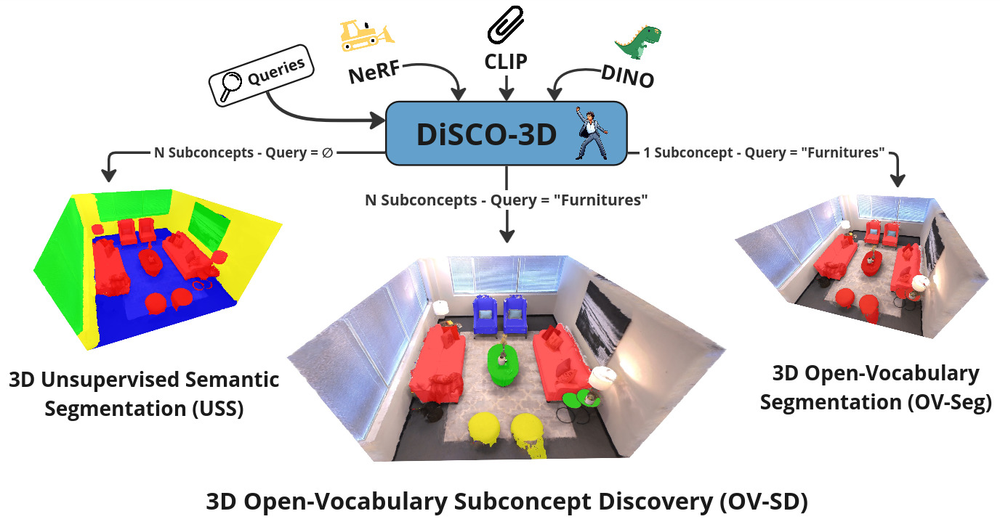

# DiSCO-3D: Discovering and Segmenting Sub-Concepts from Open-Vocabulary Queries in NeRF

DiSCO-3D is a novel method designed to solve the task of 3D Open-Vocabulary Sub-Concepts Discovery (OV-SD) by bridging the gap between unsupervised semantic segmentation and open-vocabulary segmentation in Neural Radiance Fields (NeRF). It provides scene-aware and query-adaptive semantic segmentations in complex 3D environments.

🎉 Accepted at ICCV 2025 — See you in Hawaii! 🎉
## 🔍 Overview

3D semantic segmentation provides high-level scene understanding for applications in robotics, autonomous systems, etc. Traditional methods adapt exclusively to either task-specific goals (open-vocabulary segmentation) or scene content (unsupervised semantic segmentation). We propose DiSCO-3D, the first method addressing the broader problem of 3D Open-Vocabulary Sub-concepts Discovery, which aims to provide a 3D semantic segmentation that adapts to both the scene and user queries. We build DiSCO-3D on Neural Fields representations, combining unsupervised segmentation with weak open-vocabulary guidance. Our evaluations demonstrate that DiSCO-3D achieves effective performance in Open-Vocabulary Sub-concepts Discovery and exhibits state-of-the-art results in the edge cases of both open-vocabulary and unsupervised segmentation.

## 🧠 Key Contributions

    New Task: Defines the 3D Open-Vocabulary Sub-Concepts Discovery (OV-SD) problem.

    Plug-and-Play: Compatible with existing Neural Fields (e.g., LeRF, OpenNeRF).

    Joint Segmentation Strategy: Combines OVS and USS for improved performance.

    Multi-query Support: Handles disjoint, overlapping, and nested queries.

    Strong Performance: Achieves SoTA on OV-SD and its edge cases of NeRF Open-vocabulary Segmentation and Unsupervised Semantic Segmentation.

## 📄 Paper & Supplementary Material

    - 📄 Paper & Supplementary Material: Coming soon

## 🧪 Installation & Usage

    ⚠️ Evaluation Code coming soon.

## 🧾 Citation

If you find this project useful, please cite:

'''
@inproceedings{petit2024ring,
title={RING-NeRF: Rethinking Inductive Biases for Versatile and Efficient Neural Fields},
author={Petit, Doriand and Bourgeois, Steve and Pavel, Dumitru and Gay-Bellile, Vincent and Chabot, Florian and Barthe, Loic},
journal={European Conference on Computer Vision (ECCV)},
year={2024}
}
'''

## 🙏 Acknowledgements

This work was made possible thanks to the use of the CEA List FactoryIA supercomputer, supported by the Île-de-France Regional Council.

The website design was adapted from:

    Michaël Gharbi

    Ref-NeRF

    nerfies

## 📬 Contact

For questions or collaborations, reach out via GitHub.
